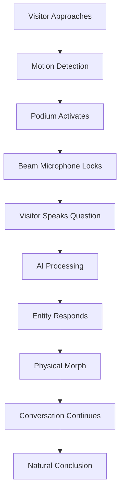

import NavBar from '../components/NavBar.astro';

<NavBar />

# The Oracle Experience (TESTING DEPLOYMENT)

## Visitor Journey

## Walk-Up Choreography

**Approach** – A soft teal glow beckons from the Oracle platform. A floor-flush bronze disc (Ø 1 m) subtly illuminates when stepped on, signaling the system's attention.

**Capture** – Beamforming microphone array plus depth camera create a rim-light halo, centering focus on the visitor while filtering ambient noise down to -48 dB.

**Dialogue** – Visitor speaks their question to Indiana's past. The Entity responds through directional speakers, voice synthesized using ElevenLabs cloning technology to match the chosen persona's authentic speech patterns.

**Morph** – When switching personas, the current entity dissolves into a mesmerizing "Fragments" particle swirl using Unreal Engine's Niagara system, then re-coalesces as the new figure in under 1 second.

**Release** – Ten seconds of silence or moving 1 meter laterally frees the microphone for the next visitor, ensuring smooth crowd flow.

## Audio Experience Sample

  

    <h3 class="text-lg font-semibold text-amber-800 mb-4">Sample Conversation</h3>
    <audio controls className="mx-auto mb-4">
      <source src="/audio/indiana_oracle_sample.m4a" type="audio/mp4" />
      Your browser does not support the audio element.
    </audio>
    

      <strong>Tap to hear a sample exchange</strong> between a visitor and the <strong>Indiana Sage</strong> — 
      our foundational oracle persona that draws from the collective wisdom and stories of the Hoosier State.
    

    

      <em>Note: The system features multiple foundational voices to ensure engaging variety in conversational tone and perspective.</em>
    

  

## Persona Transition Demo

  

    <iframe 
      src="https://www.youtube.com/embed/gCXBPtoBSvI?rel=0&modestbranding=1"
      class="w-full h-full"
      allow="encrypted-media"
      allowfullscreen
      title="Oracle Entity morphing from Kurt Vonnegut to Alfred Kinsey">
    </iframe>
  

  

    Live demonstration: Oracle Entity transitioning from Kurt Vonnegut to Alfred Kinsey
  

## Featured Oracle Demo: Lil Bub

  

    <video controls className="w-full h-full object-cover">
      <source src="/video/lil-bub-oracle-demo.mp4" type="video/mp4" />
      Your browser does not support the video element.
    </video>
  

  

    <strong>Lil Bub Oracle Visualization</strong> — Bloomington's beloved internet sensation who brought joy to millions worldwide and raised awareness for special needs pets through her unique charm. Watch as Lil Bub's spirit comes alive through the Oracle Entity technology.
  

## Accessibility Features

- **Audio Descriptions**: Full narration for visually impaired visitors
- **Closed Captions**: Real-time transcription of all spoken content
- **Height-Adjustable Interface**: Podium accommodates wheelchair users
- **Multiple Language Support**: Translation capabilities for non-English speakers
- **Simplified Mode**: Reduced complexity for cognitive accessibility
- **Sign Language Integration**: ASL interpretation for deaf and hard-of-hearing visitors

## Personality Rights & Implementation Strategy

### Permissions & Estate Relations (UPDATED)

The Oracle Entity Project operates with full respect for personality rights and estate wishes. Our implementation strategy includes:

**For Historical Figures:**
- Formal requests to literary estates (Vonnegut Estate, etc.)
- Collaboration with family representatives and legal counsel
- Revenue sharing agreements where appropriate
- Academic fair use considerations for educational contexts

**For Living Personalities:**
- Direct consultation and approval processes
- Ongoing collaboration and content oversight
- Flexible participation models (full endorsement to limited licensing)
- Clear attribution and respectful representation standards

### Robust Fallback Framework

**Primary Experience:** The **Indiana Sage** and complementary foundational personas ensure compelling visitor experiences regardless of celebrity participation status.

**Modular Design:** Individual personality modules can be activated, modified, or retired without affecting core Oracle functionality.

**Educational Focus:** All interactions prioritize historical education, cultural preservation, and civic engagement — values that transcend any single personality.

**Community-Driven Content:** Local historians, educators, and cultural leaders provide authentic Indiana perspectives that form the Oracle's knowledge foundation.

<strong>The Oracle's mission — connecting visitors with Indiana's rich history and culture — remains compelling whether enhanced by celebrity personas or powered entirely by our foundational Indiana voices.</strong>

