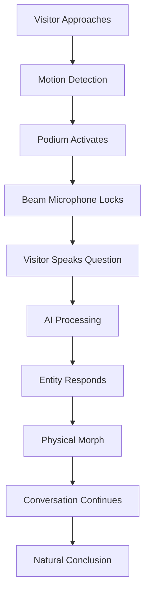

import NavBar from '../components/NavBar.astro';

<NavBar />

# The Oracle Experience

## Visitor Journey

## Walk-Up Choreography

**Approach** – The Oracle platform has a teal light. A bronze disc in the floor lights up when someone steps on it.

**Capture** – Microphone array and depth camera focus on the visitor. Background noise reduced to -48 dB.

**Dialogue** – Visitor asks a question. The Oracle responds through directional speakers using ElevenLabs voice synthesis to match the persona's speech patterns.

**Morph** – Personas change through particle effects built in Unreal Engine. The transitions cover processing time while loading the next figure.

**Release** – Ten seconds of silence or stepping away resets the system for the next visitor.

## Audio Experience Sample

  

    <h3 class="text-lg font-semibold text-amber-800 mb-4">Sample Conversation</h3>
    <audio controls class="mx-auto mb-4">
      <source src="/audio/indiana_oracle_sample.m4a" type="audio/mp4" />
      Your browser does not support the audio element.
    </audio>
    

      <strong>Tap to hear a sample exchange</strong> between a visitor and the <strong>Indiana Sage</strong> — 
      one of several default oracle voices available to all visitors.
    

    

      <em>Note: Default personas are always available for conversations.</em>
    

  

  

    <h3 class="text-lg font-semibold text-slate-800 mb-4">Vonnegut Persona Sample</h3>
    <audio controls class="mx-auto mb-4">
      <source src="/audio/von.m4a" type="audio/mp4" />
      Your browser does not support the audio element.
    </audio>
    

      <strong>Interaction snippet</strong> between a visitor and the <strong>Kurt Vonnegut persona</strong> — 
      showcasing how historical figures engage with questions about creativity, humanity, and life in Indiana.
    

    

      <em>Note: Celebrity personas require proper licensing and estate approval before public deployment.</em>
    

  

## Visitor Experience Visualization

  
  

    <strong>Live Interaction</strong> — A visitor engages in conversation with the Oracle, 
    showing the scale and presence of the holographic figure in the physical space.
  

## Persona Transition Demo

  

    <iframe 
      src="https://www.youtube.com/embed/gCXBPtoBSvI?rel=0&modestbranding=1"
      class="w-full h-full"
      allow="encrypted-media"
      allowfullscreen
      title="Oracle Entity morphing from Kurt Vonnegut to Alfred Kinsey">
    </iframe>
  

  

    Live demonstration: Oracle Entity transitioning from Kurt Vonnegut to Alfred Kinsey
  

## Featured Oracle Demo: Lil Bub

  

    <video controls className="w-full h-full object-cover">
      <source src="/video/lil-bub-oracle-demo.mp4" type="video/mp4" />
      Your browser does not support the video element.
    </video>
  

  

    <strong>Lil Bub Oracle Visualization</strong> — Bloomington's beloved internet sensation who brought joy to millions worldwide and raised awareness for special needs pets. The Oracle Entity technology renders Lil Bub's distinctive personality and charm.
  

## Accessibility Features

- **Audio Descriptions**: Full narration for visually impaired visitors
- **Closed Captions**: Real-time transcription of all spoken content
- **Height-Adjustable Interface**: Podium accommodates wheelchair users
- **Multiple Language Support**: Translation capabilities for non-English speakers
- **Simplified Mode**: Reduced complexity for cognitive accessibility
- **Sign Language Integration**: ASL interpretation for deaf and hard-of-hearing visitors

## Legal Process (Proposed for Post-Funding)

### Rights Clearance Strategy (If Funded)

**Note**: No contact has been initiated with estates or individuals at this point. Only the general Indiana Oracle is trained, with one persona as proof of concept (not public). 

**If the project receives funding, the process would include:**

- Engaging intellectual property attorneys specializing in personality rights
- Working through university intermediaries if funding comes from IU
- Establishing formal contact protocols with estates and representatives
- Developing revenue-sharing proposals where appropriate

**Proposed approach for different persona types:**

**For Historical Figures:**
- University legal departments to initiate formal estate contact
- IP attorneys to negotiate likeness rights
- Academic fair use evaluation for educational contexts
- Clear usage boundaries and content guidelines

**For Living Personalities:**
- Direct consultation through professional representatives
- Formal licensing agreements
- Ongoing approval processes for content
- Flexible participation models based on comfort level

### Fallback Framework

**Primary Experience:** The **Indiana Sage** and complementary foundational personas provide compelling visitor experiences regardless of celebrity participation status.

**Modular Design:** Individual personality modules can be activated, modified, or retired without affecting core Oracle functionality.

**Educational Focus:** All interactions prioritize historical education, cultural preservation, and civic engagement — values that transcend any single personality.

**Community-Driven Content:** Local historians, educators, and cultural leaders provide authentic Indiana perspectives that form the Oracle's knowledge foundation.

**Regional Persona Library:** Beyond historical figures, the system supports Indiana archetypes representing the state's diverse character — the limestone worker, the family farmer, the cycling enthusiast, the outdoor adventurer. These personas capture authentic Hoosier experiences and regional wisdom, adding depth to conversations regardless of celebrity participation.

<strong>The Oracle's mission — connecting visitors with Indiana's rich history and culture — remains compelling whether featuring celebrity personas or powered entirely by our foundational Indiana voices.</strong>

