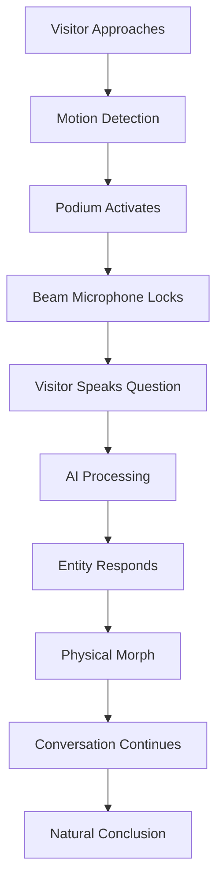

import NavBar from '../components/NavBar.astro';

<NavBar />

# The Oracle Experience

## Visitor Journey

## Walk-Up Choreography

**Approach** – A soft teal glow beckons from the Oracle platform. A floor-flush bronze disc (Ø 1 m) subtly illuminates when stepped on, signaling the system's attention.

**Capture** – Beamforming microphone array plus depth camera create a rim-light halo, centering focus on the visitor while filtering ambient noise down to -48 dB.

**Dialogue** – Visitor speaks their question to Indiana's past. The Entity responds through directional speakers, voice synthesized using ElevenLabs cloning technology to match the chosen persona's authentic speech patterns.

**Morph** – When switching personas, the current entity dissolves into a mesmerizing "Fragments" particle swirl using Unreal Engine's Niagara system, then re-coalesces as the new figure in under 1 second.

**Release** – Ten seconds of silence or moving 1 meter laterally frees the microphone for the next visitor, ensuring smooth crowd flow.

## Persona Transition Demo

  

    <iframe 
      src="https://www.youtube.com/embed/gCXBPtoBSvI?rel=0&modestbranding=1"
      class="w-full h-full"
      allow="encrypted-media"
      allowfullscreen
      title="Oracle Entity morphing from Kurt Vonnegut to Alfred Kinsey">
    </iframe>
  

  

    Live demonstration: Oracle Entity transitioning from Kurt Vonnegut to Alfred Kinsey
  

## Accessibility Features

- **Audio Descriptions**: Full narration for visually impaired visitors
- **Closed Captions**: Real-time transcription of all spoken content
- **Height-Adjustable Interface**: Podium accommodates wheelchair users
- **Multiple Language Support**: Translation capabilities for non-English speakers
- **Simplified Mode**: Reduced complexity for cognitive accessibility
- **Sign Language Integration**: ASL interpretation for deaf and hard-of-hearing visitors

