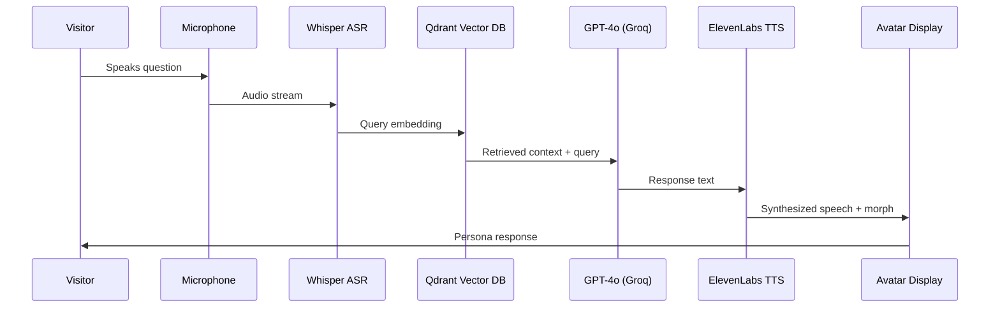
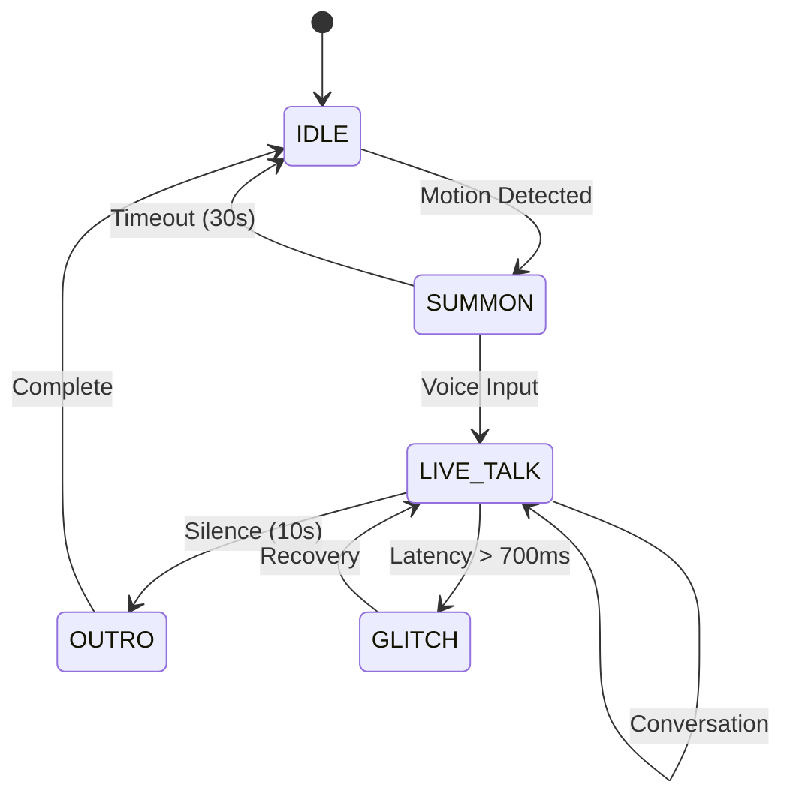

import NavBar from '../components/NavBar.astro';

<NavBar />

# Technical Architecture

## RAG Pipeline

## Performance Metrics

| Layer | Component | Spec | Latency (ms) |
|-------|-----------|------|-------------|
| Capture | ClearOne BMA-CT | 12° beam, −48 dB noise floor | &lt;10 |
| Vision | Intel RealSense D435 | 90 fps depth | &lt;10 |
| ASR | OpenAI Whisper-tiny | Local processing | 120 |
| Inference | GPT-4o 32k on Groq LPU | RAG prompt | 250–400 |
| TTS | ElevenLabs | 22050 Hz synthesis | 350 |
| Avatar mouth | HeyGen live-talk | Real-time sync | 60 |
| **Total** | | | **target &lt; 1.5s** |

## Voice Synthesis & Persona Morphing

Our AI system uses ElevenLabs' voice cloning technology to recreate the authentic speech patterns of each Indiana persona. Historical recordings, when available, are used to train persona-specific voice models. For figures without recorded speech, we employ linguistic analysis of their written works combined with regional accent modeling to create plausible voice representations.

### Fallback Strategy
- **Primary**: ElevenLabs custom voice models
- **Secondary**: Neural voice synthesis with persona-tuned parameters  
- **Tertiary**: High-quality text-to-speech with accent modification
- **Emergency**: Local model responses with pre-recorded audio during API outages

**Latency Management**: Target response under 1.5 seconds during typical load. When processing exceeds this threshold, particle animation loops maintain engagement while displaying "The Oracle is considering..." status. Local fallback models activate during cloud service interruptions.

## Oracle State Machine

The Oracle operates through a carefully orchestrated state system designed for smooth visitor interaction:

**State Descriptions:**
- **IDLE**: Ambient particle field, subtle presence indicators, motion detection active
- **SUMMON**: Particle coalescence, persona materialization (3-5 second sequence)
- **LIVE_TALK**: Full conversation mode with layered visual system and real-time responses
- **OUTRO**: Graceful dissolution, persona-specific farewell animation
- **GLITCH**: Emergency visual state during API failures or processing delays

## Content Pipeline Architecture

**Real-Time Rendering Stack:**
1. **Audio Input** → Whisper ASR → conversation state
2. **LLM Processing** → character-specific response generation  
3. **TTS Synthesis** → ElevenLabs voice cloning with persona parameters
4. **Visual Composition** → TouchDesigner/Unreal Engine real-time layering
5. **Display Output** → Calibrated projection or holographic display

**Visual Layer Management:**
- **Layer 1**: Environmental particles (always active)
- **Layer 2**: Avatar/head (conversation-driven)
- **Layer 3**: Persona particles (sentiment-reactive)
- **Layer 4**: Spatial context (faux interior geometry)
- **Layer 5**: Background void (pure black for contrast)

**Failsafe Systems:**
When cloud services lag, the system transitions to cached responses with "thinking" animations until connectivity restores. Local TTS provides basic functionality during extended outages.

## Holographic Display Technology

### Pepper's Ghost Implementation
Our primary display approach uses Pepper's Ghost illusion technology, creating convincing 3D presence without requiring special glasses:

- **Reflective Medium**: Metallised polyethylene foil (97% transmittance, 20% reflectance) or Hologauze mesh
- **Projection System**: 10-12k lumen short-throw laser projectors (Epson Pro L1200U + ELPLU03S or Panasonic PT-RZ990 + ET-DLE060)
- **Geometry**: 14 ft × 9 ft foil plane @ 45°, 8 ft × 8 ft visible image, 8 ft viewer standoff (6 ft minimum)
- **Environmental Control**: ≤50 lux ambient lighting at foil plane with blackout baffles
- **Media Pipeline**: Real-time rendering via TouchDesigner/Unreal Engine with &lt;700ms latency budget

### Alternative Display Options

**Light-Field Technology**: Looking Glass displays provide true parallax viewing for multiple simultaneous viewers (32"-65" units, $15K-$45K hardware cost).

**Transparent OLED**: Layered glass configuration allows see-through effects with particle depth layers (55" FHD panels, ~$16K per unit).

**Volumetric Projection**: Proto hologram units for reliable 3D presence in full installations.

## Hardware Specifications

### Core Computing
- **AI Processing**: NVIDIA RTX 4090 GPU cluster for real-time inference
- **Media Server**: TouchDesigner Pro or Unreal Engine for holographic rendering
- **Audio**: ClearOne BMA-CT directional beam microphone array
- **Storage**: 2TB NVMe SSD for vector database and media assets
- **Network**: Gigabit fiber connection for cloud AI services

### Display Infrastructure  
- **Primary**: 10-12k lumen short-throw laser projector
- **Holographic Medium**: Reflective film or Hologauze
- **Environmental**: DMX lighting control and ambient light management
- **Mounting**: Tensioned frame system with quick-release maintenance access

  <h3 class="text-brand-teal text-xl font-bold mb-4">Technical Documentation</h3>
  

    Download the complete Bill of Materials and technical specifications for implementation.
  

  <a 
    href="/docs/bom.xlsx" 
    download 
    class="inline-flex items-center px-4 py-2 bg-brand-amber text-brand-navy font-medium rounded hover:bg-brand-magenta transition-colors"
  >
    📄 Download BOM.xlsx
  </a>

## Visual Design Language

  

    

      <iframe 
        src="https://www.youtube.com/embed/52XGW11caQQ?autoplay=1&mute=1&loop=1&playlist=52XGW11caQQ&controls=0&showinfo=0&rel=0&iv_load_policy=3&modestbranding=1&playsinline=1"
        class="w-full h-full"
        style="border: none;"
        allow="autoplay; encrypted-media"
        allowfullscreen>
      </iframe>
    

  

  
  

    <strong>Promotional Visual Language</strong> — Art Deco meets digital futurism
  

While the Oracle entities will appear as monochromatic, spectral forms — smoky particles and digital glitches bridging past and future — the promotional materials work in a related but distinct style. They lean on Art Deco geometry, vintage electrical motifs, and kinetic motion typography to shape an "old-meets-new" aesthetic for campaign pieces and adjacent projects.

Letterforms assemble and dismantle with machine-like precision, a gesture toward temporal echoes and a nod to Indiana's manufacturing and craft traditions — from RCA's years in Bloomington to the makers and tradespeople of the Showers district. The imagery borrows from moments when technology felt theatrical and full of promise — the polish of Deco, the spark of early electronics, and the speculative tone of classic sci-fi — and ties that sensibility to the state's universities, notably IU in Bloomington, as well as Notre Dame and other research centers. Together, these elements create a visual language that connects industrial history, design heritage, and a sense of forward momentum.

## Risk Assessment & Mitigation

### Technical Risks
- **Cloud Dependency**: Local model fallbacks and response caching
- **Integration Complexity**: Modular design with well-defined APIs
- **Voice Recognition**: Push-to-talk systems and noise cancellation
- **Content Accuracy**: Historian verification and fact databases

### Operational Risks
- **Public Environment**: Durable hardware and remote monitoring
- **Maintenance**: Documentation and staff training
- **Technology Evolution**: Regular upgrade pathways and compatibility
- **Funding Sustainability**: Multiple revenue streams and partnerships

### Quality Assurance
- **Historical Accuracy**: Community advisory panels and expert review
- **Cultural Sensitivity**: Descendant community input where possible
- **Technical Reliability**: Extensive testing and failsafe mechanisms
- **User Experience**: Iterative design based on visitor feedback

