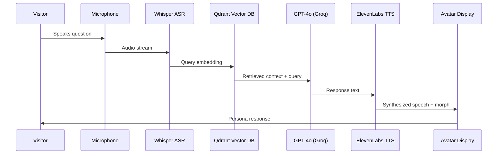

import NavBar from '../components/NavBar.astro';

<NavBar />

# Technical Architecture

## RAG Pipeline

## Performance Metrics

| Layer | Component | Spec | Latency (ms) |
|-------|-----------|------|-------------|
| Capture | ClearOne BMA-CT | 12° beam, −48 dB noise floor | <10 |
| Vision | Intel RealSense D435 | 90 fps depth | <10 |
| ASR | OpenAI Whisper-tiny | Local processing | 120 |
| Inference | GPT-4o 32k on Groq LPU | RAG prompt | 250–400 |
| TTS | ElevenLabs | 22050 Hz synthesis | 350 |
| Avatar mouth | HeyGen live-talk | Real-time sync | 60 |
| **Total** | | | **< 700ms** |

## Voice Synthesis & Persona Morphing

Our AI system leverages ElevenLabs' advanced voice cloning technology to recreate the authentic speech patterns of each Indiana persona. Historical recordings, when available, are used to train persona-specific voice models. For figures without recorded speech, we employ linguistic analysis of their written works combined with regional accent modeling to create plausible voice representations.

### Fallback Strategy
- **Primary**: ElevenLabs custom voice models
- **Secondary**: Neural voice synthesis with persona-tuned parameters  
- **Tertiary**: High-quality text-to-speech with accent modification

The physical avatar morphing system transitions seamlessly between personas using real-time face generation technology, ensuring each response is delivered with the appropriate visual representation.

## Hardware Specifications

- **Computing**: NVIDIA RTX 4090 GPU cluster for real-time AI inference
- **Audio**: Directional beam microphone array with noise cancellation
- **Visual**: 4K holographic display with depth sensing cameras
- **Storage**: 2TB NVMe SSD for vector database and media assets
- **Network**: Gigabit fiber connection for cloud AI services

  <h3 class="text-brand-teal text-xl font-bold mb-4">Technical Documentation</h3>
  

    Download the complete Bill of Materials and technical specifications for implementation.
  

  <a 
    href="/docs/bom.xlsx" 
    download 
    class="inline-flex items-center px-4 py-2 bg-brand-amber text-brand-navy font-medium rounded hover:bg-brand-magenta transition-colors"
  >
    📄 Download BOM.xlsx
  </a>

