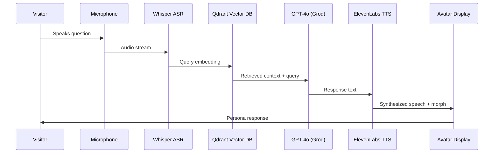

import NavBar from '../components/NavBar.astro';

<NavBar />

# Technical Architecture

## RAG Pipeline

## Performance Metrics

| Layer | Component | Spec | Latency (ms) |
|-------|-----------|------|-------------|
| Capture | ClearOne BMA-CT | 12° beam, −48 dB noise floor | &lt;10 |
| Vision | Intel RealSense D435 | 90 fps depth | &lt;10 |
| ASR | OpenAI Whisper-tiny | Local processing | 120 |
| Inference | GPT-4o 32k on Groq LPU | RAG prompt | 250–400 |
| TTS | ElevenLabs | 22050 Hz synthesis | 350 |
| Avatar mouth | HeyGen live-talk | Real-time sync | 60 |
| **Total** | | | **&lt; 700ms** |

## Voice Synthesis & Persona Morphing

Our AI system leverages ElevenLabs' advanced voice cloning technology to recreate the authentic speech patterns of each Indiana persona. Historical recordings, when available, are used to train persona-specific voice models. For figures without recorded speech, we employ linguistic analysis of their written works combined with regional accent modeling to create plausible voice representations.

### Fallback Strategy
- **Primary**: ElevenLabs custom voice models
- **Secondary**: Neural voice synthesis with persona-tuned parameters  
- **Tertiary**: High-quality text-to-speech with accent modification

The physical avatar morphing system transitions seamlessly between personas using real-time face generation technology, ensuring each response is delivered with the appropriate visual representation.

## Holographic Display Technology

### Pepper's Ghost Implementation
Our primary display approach uses advanced Pepper's Ghost illusion technology, creating convincing 3D presence without requiring special glasses:

- **Reflective Medium**: Metallised polyethylene foil (97% transmittance, 20% reflectance) or professional Hologauze mesh
- **Projection System**: 10-12k lumen short-throw laser projectors with lens shift capabilities  
- **Geometry**: 45° angled reflective surface with 6+ ft viewer standoff distance
- **Environmental Control**: Sub-50 lux ambient lighting with targeted illumination
- **Media Pipeline**: Real-time rendering via TouchDesigner/Unreal Engine with &lt;50ms latency

### Alternative Display Options

**Light-Field Technology**: Looking Glass displays provide true parallax viewing for multiple simultaneous viewers (32"-65" units, $15K-$45K hardware cost).

**Transparent OLED**: Layered glass configuration allows see-through effects with particle depth layers (55" FHD panels, ~$16K per unit).

**Volumetric Projection**: Proto hologram units for reliable 3D presence in premium installations.

## Hardware Specifications

### Core Computing
- **AI Processing**: NVIDIA RTX 4090 GPU cluster for real-time inference
- **Media Server**: TouchDesigner Pro or Unreal Engine for holographic rendering
- **Audio**: ClearOne BMA-CT directional beam microphone array
- **Storage**: 2TB NVMe SSD for vector database and media assets
- **Network**: Gigabit fiber connection for cloud AI services

### Display Infrastructure  
- **Primary**: 10-12k lumen short-throw laser projector
- **Holographic Medium**: Professional-grade reflective film or Hologauze
- **Environmental**: DMX lighting control and ambient light management
- **Mounting**: Tensioned frame system with quick-release maintenance access

  <h3 class="text-brand-teal text-xl font-bold mb-4">Technical Documentation</h3>
  

    Download the complete Bill of Materials and technical specifications for implementation.
  

  <a 
    href="/docs/bom.xlsx" 
    download 
    class="inline-flex items-center px-4 py-2 bg-brand-amber text-brand-navy font-medium rounded hover:bg-brand-magenta transition-colors"
  >
    📄 Download BOM.xlsx
  </a>

## Visual Design Language

  

    

      <iframe 
        src="https://www.youtube.com/embed/52XGW11caQQ?autoplay=1&mute=1&loop=1&playlist=52XGW11caQQ&controls=0&showinfo=0&rel=0&iv_load_policy=3&modestbranding=1&playsinline=1"
        class="w-full h-full"
        style="border: none;"
        allow="autoplay; encrypted-media"
        allowfullscreen>
      </iframe>
    

  

  
  

    <strong>Promotional Visual Language</strong> — Art Deco meets digital futurism
  

While the Oracle entities themselves manifest as monochromatic, spectral forms — particle clouds and digital wisps bridging past and future — the project's promotional aesthetic draws from Indiana's rich cultural heritage. The visual language merges Art Deco elegance with contemporary digital craft, honoring both Bloomington's industrial past (from RCA's former presence to the craftspeople of the Showers district) and its future-forward institutions like IU's pioneering research programs.

This mechanical typography, with its precise assembly and disassembly of letterforms, echoes the concept of temporal "echoes" while nodding to Indiana's manufacturing heritage. The aesthetic bridges the glamour of French Lick's gilded age with the aspirational futurism of university research, creating a visual identity that feels both rooted in place and reaching toward tomorrow.

## Risk Assessment & Mitigation

### Technical Risks
- **Cloud Dependency**: Local model fallbacks and response caching
- **Integration Complexity**: Modular design with well-defined APIs
- **Voice Recognition**: Push-to-talk systems and noise cancellation
- **Content Accuracy**: Historian verification and fact databases

### Operational Risks
- **Public Environment**: Robust hardware and remote monitoring
- **Maintenance**: Comprehensive documentation and staff training
- **Technology Evolution**: Regular upgrade pathways and compatibility
- **Funding Sustainability**: Multiple revenue streams and partnerships

### Quality Assurance
- **Historical Accuracy**: Community advisory panels and expert review
- **Cultural Sensitivity**: Descendant community input where possible
- **Technical Reliability**: Extensive testing and failsafe mechanisms
- **User Experience**: Iterative design based on visitor feedback

